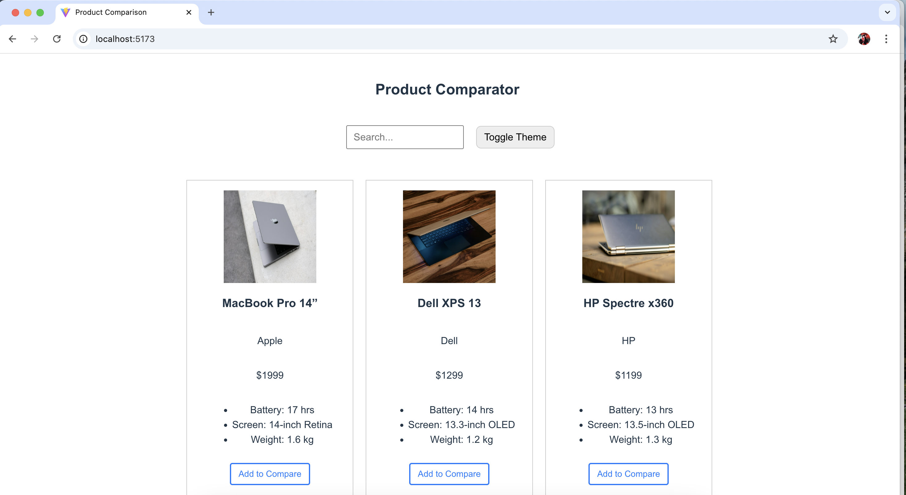
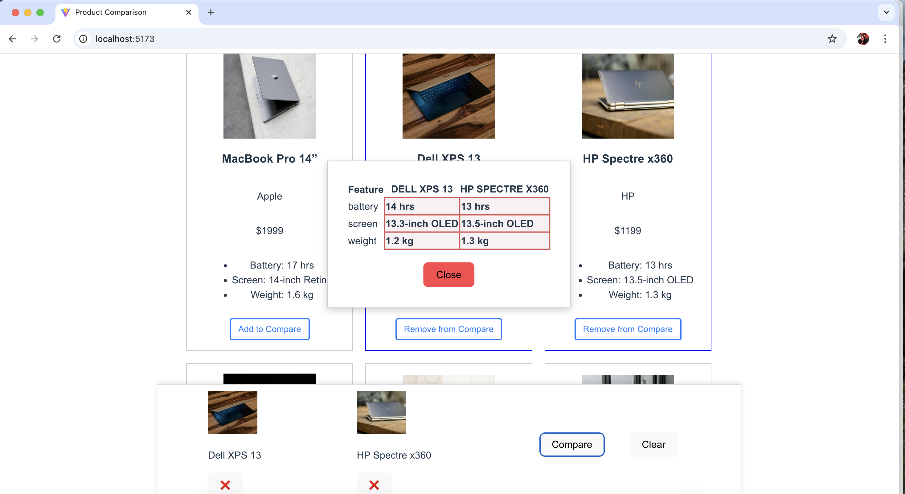
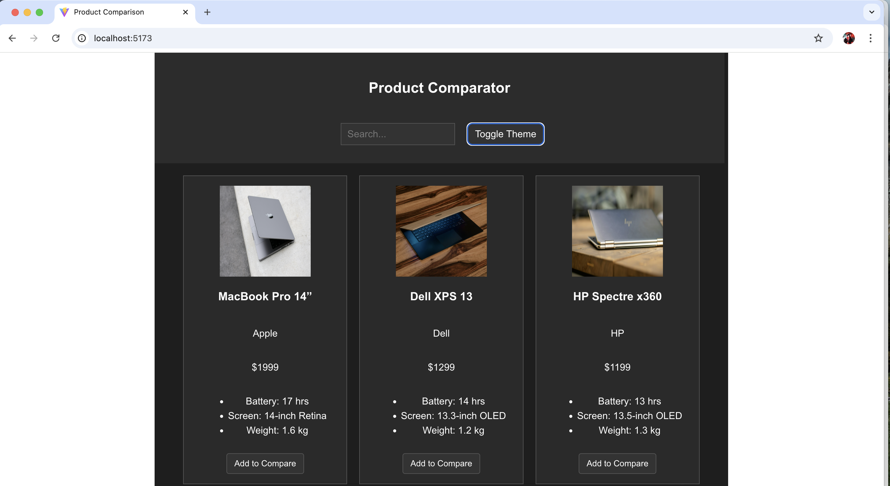
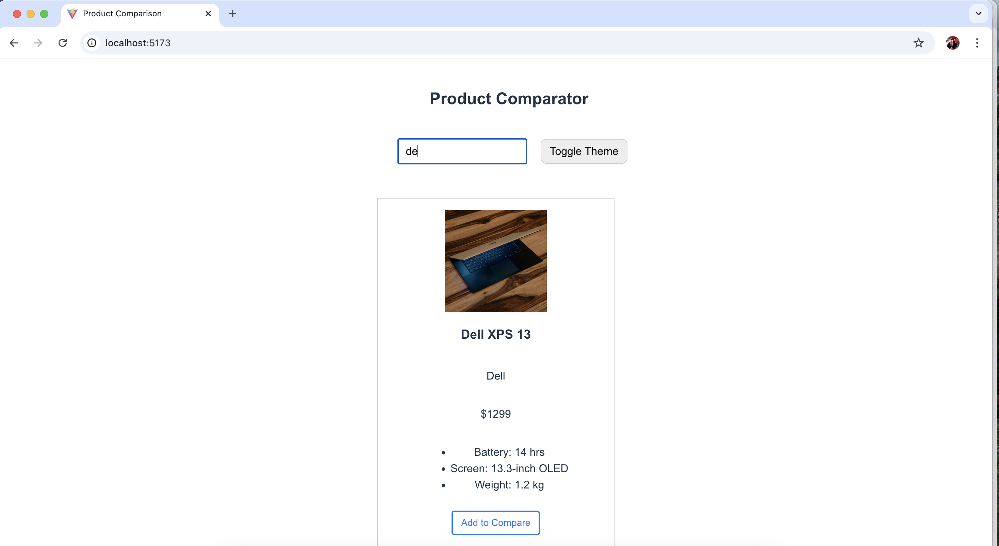

# 🛍️ Product Comparison App

An interactive, responsive React web app that lets users compare laptops side-by-side. Built using **React**, **Vite**, and **TypeScript**, with support for dark mode, keyboard accessibility, and local storage persistence.

---

## 🚀 Live Demo

👉 [Live Preview (Netlify/GitHub Pages)](https://your-deployment-url.com)  
_(Replace with your actual deployment link)_

---

## 📦 Tech Stack

- **React + TypeScript**
- **Vite** (for fast development build)
- **HTML5 + CSS3**

---

## ✅ Features

### 🔍 Product List

- Displays a responsive grid of 8 laptop products.
- Each product includes:
  - Name
  - Brand
  - Image
  - Price
  - Key Features (Battery life, screen, weight)
  - “Add to Compare” button

### 🆚 Product Comparison

- Select up to **3 products** to compare.
- A comparison bar appears at the bottom.
- Clicking "Compare" opens a **side-by-side comparison table**.
- Feature differences are **highlighted**.

### 💡 Dark Mode

- Toggle between Light and Dark themes.
- Preference is saved using `localStorage`.

### 🎯 Keyboard Accessibility

- You can select and compare products using `Tab`, `Enter`, and `Space`.

### 💾 Persistent State

- Comparison list and theme are preserved across page reloads using `localStorage`.

---

## 📸 Screenshots


### Homepage


### Comparison Bar


### Comparison Table


### Dark Theme


### Search



## 🛠 Setup Instructions

1. **Clone the repo**

```bash
git clone https://github.com/indurawat123/product-comparator.git
cd product-comparison-app
